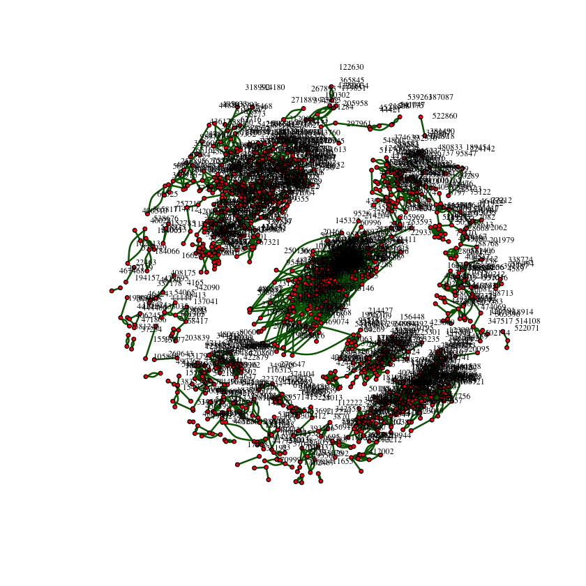
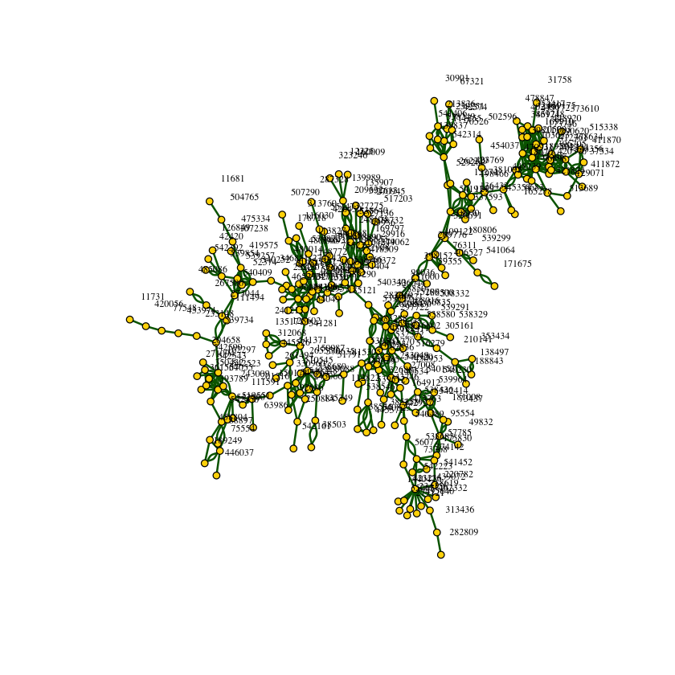
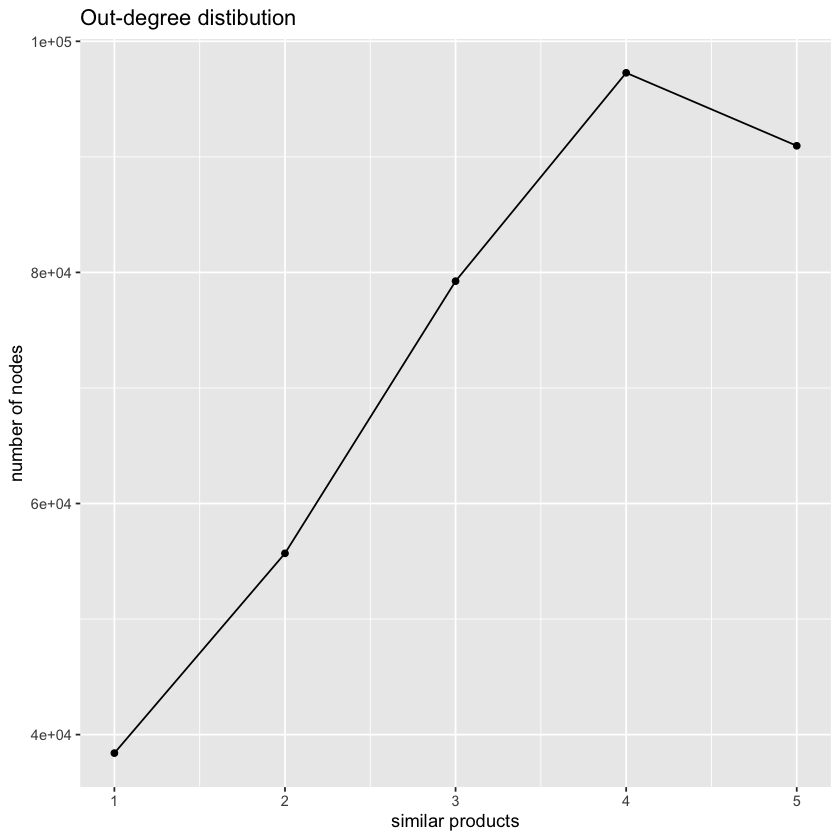
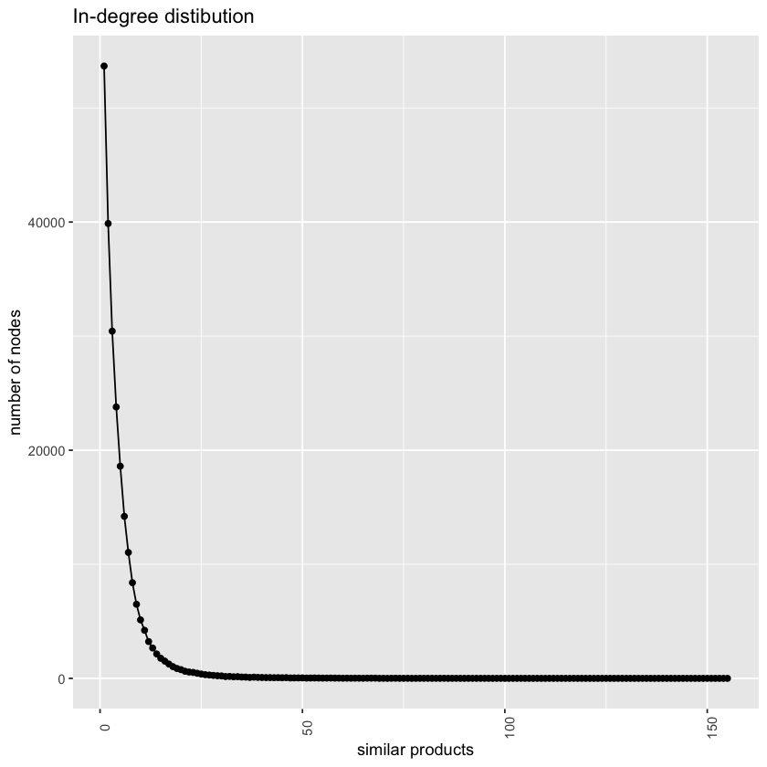
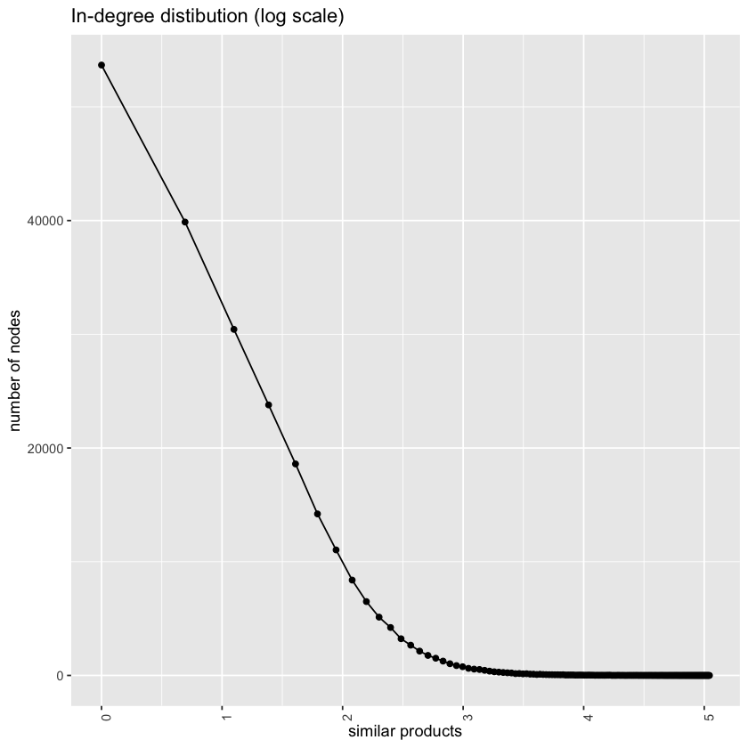

# Amazon product co-purchasing network metadata
#### Mohammad Hamza Laghari
Network Analytics Assignment


```R
library(igraph)
library(tidyverse)
library(dplyr)
library(skimr)
library(ggplot2)
library(stringr)
library(scales)
library(psych)

```

    
    Attaching package: ‘psych’
    
    
    The following objects are masked from ‘package:scales’:
    
        alpha, rescale
    
    
    The following objects are masked from ‘package:ggplot2’:
    
        %+%, alpha
    
    


# Loading the data

Plot the network using the information in the file graph subset rank1000.txt. Note that
this is not the complete network, but only a subset of edges between top-ranked products.
By visualizing the graph, you get an idea of the structure of the network you will be working
on. In addition to plotting, comment on anything interesting you observe


```R
graph1 <- read.graph(file="/Users/mhlaghari/Downloads/data 3/graph_subset_rank1000.txt", format ="ncol")
```


```R
#1355 nodes; 2611 edges
graph1
```


    IGRAPH 6421fc9 UN-- 1355 2611 -- 
    + attr: name (v/c)
    + edges from 6421fc9 (vertex names):
     [1] 411653--94292  68951 --478494 236897--265343 236897--265343 236897--472765
     [6] 153184--172503 172503--424919 469074--48638  48638 --480433 220748--42974 
    [11] 220748--42974  491768--105110 105110--291610 491768--105110 67371 --78848 
    [16] 120884--390297 390297--212405 355494--325446 29203 --349384 349384--20195 
    [21] 349384--444150 349384--285340 5039  --246337 325446--21728  21728 --530653
    [26] 21728 --265598 355494--21728  216323--354795 45094 --96553  45094 --96553 
    [31] 342416--49527  445728--363808 267451--30639  287962--20466  153184--172503
    [36] 153184--265468 153184--88060  153184--401507 153184--424919 153184--353676
    + ... omitted several edges


```R
#to verify nodes and edges
cat("Nodes: ", vcount(graph1),"\n") #for nodes
cat("Edges: ", ecount(graph1)) #for edges
```

    Nodes:  1355 
    Edges:  2611


```R
#Get nodes
V(graph1)
```


    + 1355/1355 vertices, named, from 6421fc9:
       [1] 411653 94292  68951  478494 236897 265343 472765 153184 172503 424919
      [11] 469074 48638  480433 220748 42974  491768 105110 291610 67371  78848 
      [21] 120884 390297 212405 355494 325446 29203  349384 20195  444150 285340
      [31] 5039   246337 21728  530653 265598 216323 354795 45094  96553  342416
      [41] 49527  445728 363808 267451 30639  287962 20466  265468 88060  401507
      [51] 353676 443284 33304  95210  124568 17994  374639 48316  535849 367733
      [61] 83582  30695  468264 84492  225301 572    87559  315493 54800  488883
      [71] 337679 209067 97692  35109  531651 108364 108187 13198  25341  65731 
      [81] 117196 62210  178132 144372 458306 324938 214842 197455 334110 61751 
      [91] 397309 97533  429060 100805 61718  313421 420909 514999 281633 178948
    + ... omitted several vertices


```R
#Get Edges
E(graph1)
```


    + 2611/2611 edges from 6421fc9 (vertex names):
     [1] 411653--94292  68951 --478494 236897--265343 236897--265343 236897--472765
     [6] 153184--172503 172503--424919 469074--48638  48638 --480433 220748--42974 
    [11] 220748--42974  491768--105110 105110--291610 491768--105110 67371 --78848 
    [16] 120884--390297 390297--212405 355494--325446 29203 --349384 349384--20195 
    [21] 349384--444150 349384--285340 5039  --246337 325446--21728  21728 --530653
    [26] 21728 --265598 355494--21728  216323--354795 45094 --96553  45094 --96553 
    [31] 342416--49527  445728--363808 267451--30639  287962--20466  153184--172503
    [36] 153184--265468 153184--88060  153184--401507 153184--424919 153184--353676
    [41] 153184--443284 153184--33304  153184--95210  124568--17994  17994 --374639
    [46] 17994 --48316  17994 --535849 17994 --367733 124568--367733 83582 --30695 
    + ... omitted several edges


```R
#is the graph directed?
is.directed(graph1)
```


FALSE


# Plotting the graph


```R
plot.igraph(graph1,layout=layout.kamada.kawai,
            edge.width= 2,
            edge.color="darkgreen", 
            vertex.color="red", 
            vertex.size=2, 
            vertex.label.color="black", 
            vertex.label.cex=0.6, 
            vertex.label.dist=2)
```


    

    


The graph isn't fully connected

#  Part 3.2
Now, use the file graph subset rank1000 cc.txt to plot only the largest connected component in the above network. You should be able to reuse your code from above on the new
data.


```R
graph2 <- read.graph(file="/Users/mhlaghari/Downloads/data 3/graph_subset_rank1000_cc.txt", format ="ncol")
graph2
```


    IGRAPH b93f607 UN-- 292 604 -- 
    + attr: name (v/c)
    + edges from b93f607 (vertex names):
     [1] 415305--112822 297722--116802 116802--182411 539734--273044 273044--267500
     [6] 539367--538785 538785--538546 540230--540153 540153--539964 540153--516279
    [11] 540230--540153 540230--542414 540230--539964 171675--541064 539367--538785
    [16] 415305--539367 539367--447339 539367--82836  539367--48611  73768 --274142
    [21] 95554 --73437  540153--542414 540230--542414 542414--73437  539964--542414
    [26] 542414--95554  75527 --426430 312068--128602 128602--135171 128602--241213
    [31] 381095--12274  12274 --541914 12274 --198466 12274 --423769 12274 --1299  
    [36] 12274 --136432 12274 --529269 12274 --262229 312068--135171 128602--135171
    + ... omitted several edges


```R
# Is the graph directed?
is.directed(graph2)
```


FALSE


```R
cat("Nodes: ", vcount(graph2),"\n") #for nodes
cat("Edges: ", ecount(graph2)) #for edges
```

    Nodes:  292 
    Edges:  604


```R
plot.igraph(graph2,layout=layout.kamada.kawai,
            edge.width= 2,
            edge.color="darkgreen", 
            vertex.color="gold", 
            vertex.size=3, 
            vertex.label.color="black", 
            vertex.label.cex=0.6, 
            vertex.label.dist=2)
```


    

    


# Part 4.1
Plot the out-degree distribution of our dataset (x-axis number of similar products, y-axis
number of nodes). That is, for each product a, count the number of outgoing links to another
product page b such that a → b.

Hint: The following steps will outline one way to approach this problem.

(a) Start by calculating the out-degree for each product. You may use the table command
in R or a dict in Python to compute the number of outbound links for each product.

(b) You can then apply the same process you just used so that you can count the number of
products (nodes) that have a particular number of outgoing links. This is the out-degree
distribution.

(c) Once you are done, you can use the default plotting environment in R, ggplot2
in R,or matplotlib3 in Python to plot the distribution. Note that you can avoid step (b) if
you use the geom density() function in ggplot or the hist() method in matplotlib.

However, you may approach this any way you wish.


```R
data <- read.csv('/Users/mhlaghari/Downloads/data 3/graph_complete.txt', sep = ' ', header = FALSE)
id <- read.csv('/Users/mhlaghari/Downloads/data 3/id_to_titles.txt', sep=' ')
```


```R
# create a directed graph
graph3 <- read.graph(file="/Users/mhlaghari/Downloads/data 3/graph_complete.txt", format ="ncol")
graph3 <- as.directed(graph3)
graph3
```


    IGRAPH fe81d46 DN-- 366987 2462800 -- 
    + attr: name (v/c)
    + edges from fe81d46 (vertex names):
     [1] 140890->11405  11405 ->204319 1046  ->137479 137479->170475 183024->95075 
     [6] 95075 ->231749 405486->353453 272171->295744 295744->293925 295744->39760 
    [11] 295744->447055 295744->55313  295744->364778 295744->176964 295744->454565
    [16] 295744->306149 295744->284831 272171->295744 272171->293925 272171->447055
    [21] 272171->176964 272171->454565 272171->306149 39760 ->145536 55313 ->145536
    [26] 284831->145536 295744->293925 272171->293925 293925->145536 293925->39760 
    [31] 293925->447055 293925->55313  293925->364778 293925->454565 293925->203692
    [36] 293925->284831 293925->286635 293925->82947  39760 ->145536 39760 ->55313 
    + ... omitted several edges


```R
# Is the graph directed?
is.directed(graph3)
```


TRUE


```R
cat("Nodes: ", vcount(graph3),"\n") #for nodes
cat("Edges: ", ecount(graph3)) #for edges
```

    Nodes:  366987 
    Edges:  2462800

#### Out Degree Distribution


```R
#method 1
#Step a
out1 <- table(data$V1)
```


```R
#Step b
out_degree <- data.frame(table(out1))
out_degree$out1<- as.numeric(out_degree$out1)
```


```R
#Step c
ggplot(out_degree ,aes(x=out1, y=Freq)) +
  geom_point()+ geom_line()+
  labs(x='similar products', y='number of nodes')+
  ggtitle("Out-degree distibution")

```


    

    


# Part 4.2
Above, you should have found that each product contains a maximum of five outbound links
to similar products in the dataset. Now, plot the in-degree distribution of our dataset (x-axis
number of similar products, y-axis number of nodes). That is, for each product a, count the
number of incoming links from another product page b such that b → a. You can use the
same steps outlined above. Is the distribution different? Comment on what you observe.

#### In Degree Distribution


```R
# step a
in1 <- table(data$V2)
```


```R
# step b
in_degree <- data.frame(table(in1))
in_degree$in1<- as.numeric(in_degree$in1)
```


```R
# step c
ggplot(in_degree ,aes(x=in1, y=Freq), group=1) +
  geom_point()+ geom_line()+
  theme(axis.text.x = element_text(angle = 90))+
  labs(x='similar products', y='number of nodes')+
  ggtitle("In-degree distibution")
```


    

    


OBSERVATION: The distribution is different most of the products have only one inbound link and the maximum number of inbound links is 549.


# Part 4.3
Transform the x-axis of the previous graph to log scale, to get a better understanding of
the distribution. Note here that you should have some products with 0 inbound links. This
means that using the log of the x-axis will fail since log(0) will not be valid. Due to this, you
should replace 0 with 0.1. Comment on what you observe.


```R
# plot previous graph by transforming x-axis to log scale

ggplot(in_degree ,aes(x=log(in1), y=Freq), group=1) +
  geom_point()+ geom_line()+
  theme(axis.text.x = element_text(angle = 90))+
  labs(x='similar products', y='number of nodes')+
  ggtitle("In-degree distibution (log scale)")
```


    

    


# Part 4.4
Compute the average number of inbound co-purchase links, the standard deviation, and the
maximum. Comment on the result.


```R
paste("The Average number of inbound co-purchase links is:",round(mean(in1), 1))
paste("The Standard deviation of inbound co-purchase links is:",round(sd(in1), 1))
paste("The maximum of inbound co-purchase links is:", max(in1))
```


'The Average number of inbound co-purchase links is: 5.2'


'The Standard deviation of inbound co-purchase links is: 6.8'


'The maximum of inbound co-purchase links is: 549'


# Part 4.5
Report the names of the 10 products with the most inbound co-purchase links


```R
in1_df <- data.frame(in1)
in1_df$Var1<- as.numeric(in1_df$Var1)
```


```R
# join in-degree data frame with Title 
in_deg_title <- in1_df %>%inner_join(id, by = c("Var1" = "id"))
```


```R
# find top 10 product with the most inbound links
top10 <-as.data.frame(head(in_deg_title[order(in_deg_title$`Freq`, decreasing = T),],n=10))
```


```R
paste("The name of top 10 products with most inbound co-purchase are : ")
paste(top10$title, sep = '\n')
```


'The name of top 10 products with most inbound co-purchase are : '


<style>
.list-inline {list-style: none; margin:0; padding: 0}
.list-inline>li {display: inline-block}
.list-inline>li:not(:last-child)::after {content: "\00b7"; padding: 0 .5ex}
</style>
<ol class=list-inline><li>'Sacred Hoops : Spiritual Lessons of a Hardwood Warrior'</li><li>'Spiritual Warfare in a Believer\'s Life'</li><li>'Her Choice to Heal: Finding Spiritual and Emotional Peace After Abortion'</li><li>'No More Wacos: What\'s Wrong With Federal Law Enforcement and How to Fix It'</li><li>'Tables and Chairs (The Best of Fine Woodworking)'</li><li>'Killer Instincts: Anaconda - Giant Snake of the Amazon'</li><li>'The Inspector and Mrs. Jeffries (Victorian Mystery)'</li><li>'0898'</li><li>'Improve Your Self Image (Love Tape/Audio Cassette)'</li><li>'Ortho\'s All About Landscaping Decks, Patios, and Balconies (Ortho\'s All About Gardening)'</li></ol>


